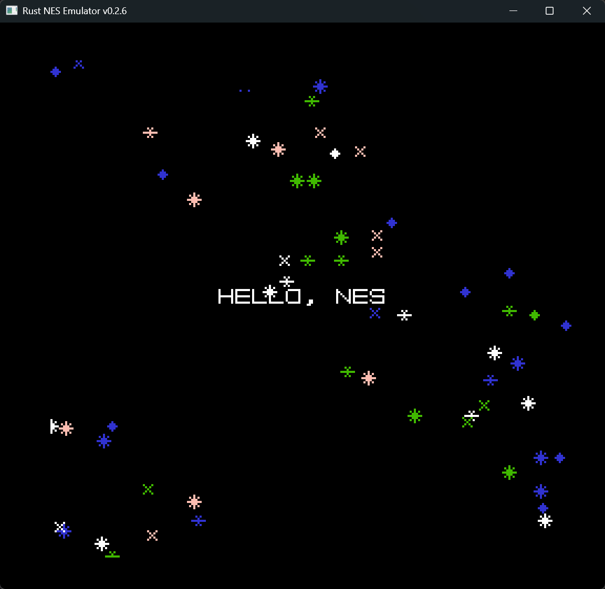
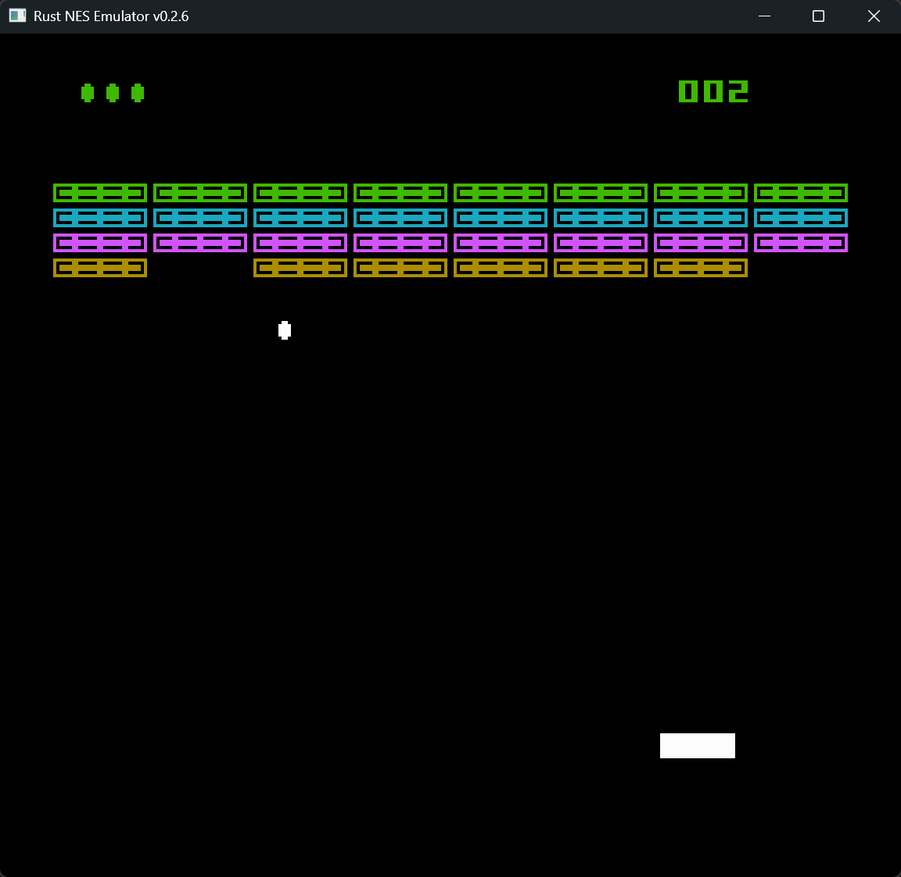

# game_examples

This directory is the root of the NES game development environment.

- Create each game project under `projects/`
- Manage generated ROM files (`.nes`) and related assets here
- Verify behavior with this repository's emulator (`rust_emu`)

## Prerequisites

- Docker Desktop installed
- `docker compose` command available

## Usage

Run from `game_examples`:

```bash
make build PROJECT=hello_nes
```

To build the Breakout sample:

```bash
make build PROJECT=breakout
```

To build and launch the emulator:

```bash
make run PROJECT=hello_nes
```

```bash
make run PROJECT=breakout
```

On the first run, Docker image build is triggered. After success, for example:

- `projects/hello_nes/build/hello_nes.nes`

## Troubleshooting (Windows without `make`)

In PowerShell or Command Prompt, you may see errors like:

- `make : The term 'make' is not recognized...`
- `'make' is not recognized as an internal or external command`

In this repository, the actual build runs inside a Docker container, so you can run `docker compose run` directly instead of `make`.

```bash
docker compose run --rm nesdev make build PROJECT=hello_nes
```

For Breakout:

```bash
docker compose run --rm nesdev make build PROJECT=breakout
```

To build and then launch the emulator:

```bash
docker compose run --rm nesdev make run PROJECT=hello_nes
```

If you want to use the `make` command directly, run the `Makefile` in `game_examples` from a shell that includes `make` (for example Git Bash / WSL / MSYS2).

Alternatively, install `make` on Windows and add it to PATH:

```bash
winget install -e --id GnuWin32.Make
```

Add `C:\Program Files (x86)\GnuWin32\bin` to your environment variable `PATH`.

## Added Structure

- `docker/Dockerfile`: NES development toolchain (`cc65`, `make`)
- `docker-compose.yml`: Development container definition
- `Makefile`: Build/clean/shell operations via Docker
- `projects/hello_nes`: Minimal ROM generation sample
- `projects/breakout`: Breakout sample

## Screenshots

### Hello NES



### Breakout



